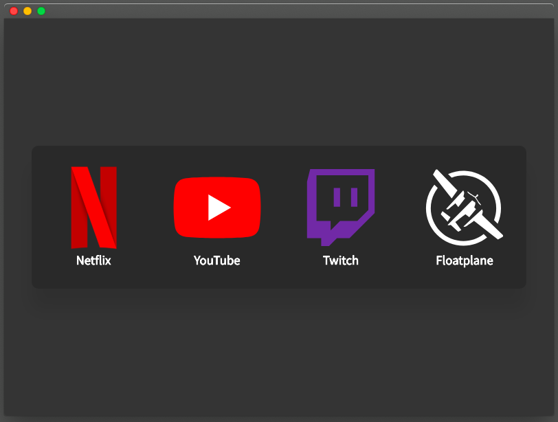

## ElectronPlayer

An Electron Based Web Video Services Player. Supporting Netflix, Youtube, Twitch, Amazon Prime Video And More.



_The apps main menu interface_

## The Pain of Widevine

People using this app should be aware of its difficultly to maintain due to the requirement of Widevine. Widevine is a DRM plugin created by Google and it is used by Netflix, Hulu and many other streaming services. Widevine has already caused an outright fail of Netflix within this app and the only solution I could find ended up with the app having multiple `package.json` files one for each os. They also each use different versions of Electron. The Mac version is using the older version of Electron and it is locked on a version which was published on the 5th of June 2019. Unless a fix presents itself this app will be discontinued in its current form when Netflix stop working on Mac. I have no clue when that will be but my guess is 1-2 years because I am sadly not expecting any working solutions to come foward. The only other possible solution is obtaining a Widevine signing certificate from Google. Which is not possible due to this being a "small" open source project. I may also [copy metastream](https://github.com/samuelmaddock/metastream/issues/85) and move the app to a browser based PWA instead of fully discontinuing it. A good article about this issue can be [read here](https://blog.samuelmaddock.com/posts/google-widevine-blocked-my-browser/).

# Features

- Multiple Streaming Services Support (JSON Configuration to add extra)
- Adblock
- Always On Top Window
- Set Startup Page (Any Service or Remember Last Opended Page)
- Frameless Window
- Rough Mac Picture in Picture Support (Floating Window, Above All Desktop and Fullscreen Applications)
- Full Screen Window on Startup

# Developing


```bash
git clone https://github.com/rodolphe37/electron-player-v1.git
cd ElectronPlayer/

# For Linux
ln -s package.linux.json package.json
# For Mac
ln -s package.mac.json package.json

npm install
npm start
```
